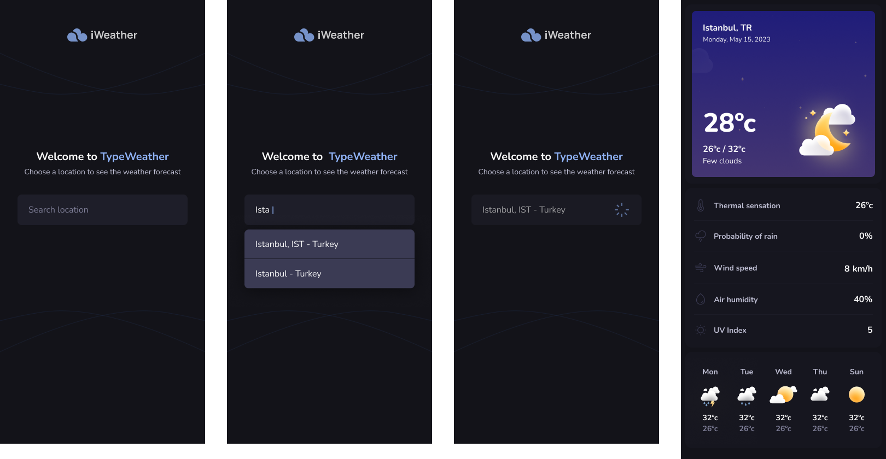

# **React Staj Mülakat Projesi**

### Proje Adı : Hava Durumu Uygulaması

#### Amaç : Kendi hava durumu uygulamalarını geliştiren adaylar, API kullanımı, asenkron veri işleme ve dinamik içerik yönetimi gibi konularda becerilerini sergileme fırsatı bulacaklar.

#### Figma UI Link: <a>https://www.figma.com/file/CmZupOVTB1WkYfLwElyzLL/iWeather?type=design&node-id=3%3A376&mode=design&t=Fccntqhigcu1L8Xv-1</a>

## Gereksinimler

- **Api Kullanımı**: OpenWeatherMap gibi popüler bir hava durumu API'sinden gerçek zamanlı hava durumu verileri çekilmeli.

- **Hava Durumu Detayları**: Seçilen şehrin sıcaklık, nem, rüzgar hızı, hava durumu açıklaması (güneşli, bulutlu, yağmurlu vb.) gibi temel bilgileri gösterilmeli.

- **Arama İşlevi**: Kullanıcılar, şehir adı girerek o şehre ait güncel hava durumu bilgilerini sorgulayabilmeli.

- **Çoklu Şehir Desteği**: Kullanıcılar, birden fazla şehrin hava durumu bilgisini sırayla görüntüleyebilmeli.

 

## Ek Özellikler

- **Geolokasyon Desteği**: Kullanıcının mevcut konumunu kullanarak otomatik hava durumu bilgisi sağlama.

- **Grafikler ve Görselleştirme**: Sıcaklık değişimleri gibi belirli verileri grafikler aracılığıyla görselleştirme.

- **Responsive Tasarım**: Uygulama, çeşitli cihaz ve ekran boyutlarında düzgün bir şekilde görüntülenmeli.

- **Hava Durumu İkonları**: Mevcut hava durumunu yansıtan dinamik ikonlar veya görseller kullanılmalı.

 

## Teknik Detaylar

- **Axios Kullanımı**: Veri çekme işlemleri için Axios kullanılmalı.

- **Frontend Teknolojileri**: React Native kullanılmalı.

- **Hata Yönetimi**: API sorgularında oluşabilecek hatalar (yanlış şehir adı, API limit aşımı vb.) kullanıcıya anlaşılır mesajlar halinde gösterilmeli.

- **Hava Durumu İkonları**: Mevcut hava durumunu yansıtan dinamik ikonlar veya görseller kullanılmalı.

 

# Teslim Kriterleri:

- Proje kaynak kodları GitHub'da bir repo olarak yayınlanmalı.

# Teslim adresi

- Proje kaynak kodları GitHub'da bir repo olarak yayınlanmalı.
- Bu repo URL'ini [hello@reactstaj.com](mailto:hello@reactstaj.com) adresine göndermelisiniz.
- Başarılar dileriz
